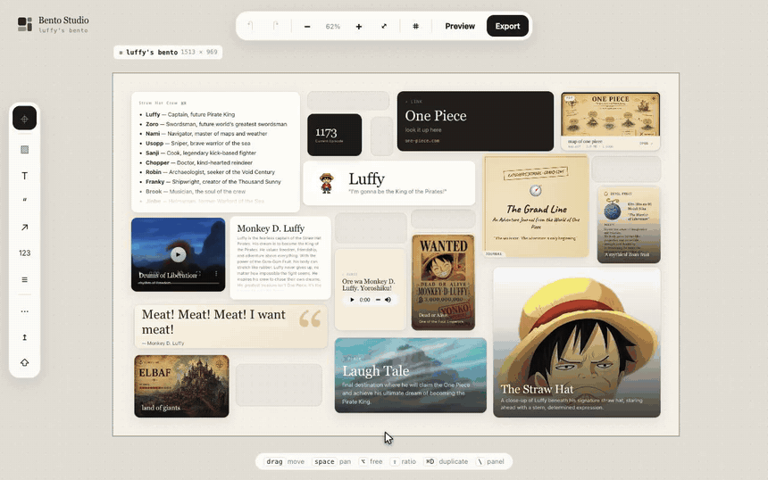
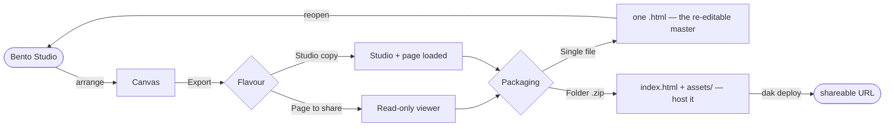

<div align="center">

<br/>

<p align="center"></p>

#### The whole Bento Studio — one HTML file, zero setup.

Bento Studio turns information into visual **pages you can own as files**. Arrange
images, video, audio, PDFs, notes, maps and people on a canvas, then export a
**self-contained Bento Page** you can open anywhere, share, or host.

<br/>

## See it in action

<a href="https://luffy-page.mybento.workers.dev" target="_blank" rel="noopener noreferrer"></a>

<sub>Build it in the editor → **Preview** → images zoom · YouTube & video play · audio plays · PDFs, maps & journals open</sub>

<br/>

<a href="https://luffy-page.mybento.workers.dev" target="_blank" rel="noopener noreferrer"></a>
&nbsp;&nbsp;
<a href="https://studio.mybento.workers.dev" target="_blank" rel="noopener noreferrer"></a>

<sub>or read the **[deploy guide](deploy/deploy.md)** to host your own</sub>

<br/><br/>


</div>

---

## Why Bento Studio

Documents that live in the cloud die in the cloud. Bento Studio is the opposite:
the **editor**, the **Bento Page**, and everything in it are plain files that
travel together. Double-click to open. No server, no account, no build, no
internet required. What you arrange is exactly what ships.

---

## What's inside

| Feature | |
|---|---|
| **Canvas editor** | Drag, resize, rotate and layer cards on a free canvas — snap, align, distribute. |
| **13 block types** | `image` · `video` · `audio` · `pdf` · `text` · `markdown` · `quote` · `number` · `link` · `place` · `person` · `embed` · `spacer` |
| **Self-contained** | Every asset inlines into one HTML file — works offline, forever. |
| **True round-trip** | Reopen any export back in the Studio and keep editing. Export is not a one-way door. |
| **Real media** | Video plays, audio plays, PDFs render page-by-page, embeds run sandboxed. |
| **PNG export** | Flatten the whole composition to a crisp 2× image for sharing. |

---

## How it flows



**Two flavours × two packagings** — pick what the moment needs:

| | Single file (`.html`) | Folder (`.zip`) |
|---|---|---|
| **Page to share** | Opens anywhere. Your master copy. | Tiny `index.html` + `assets/` — **host this.** |
| **Studio copy** | Portable Studio with the page inside. | Hosted, editable Studio. |

> **Rule of thumb:** single file = the re-editable **master**, zip = for **hosting**.

---

## Quick start

```bash
# 1. Open the Studio — that's the whole app
open bento-studio.html

# 2. Build a page, then Export (Cmd/Ctrl + E)

# 3. Publish it live with dak
unzip -o examples/luffy/page/luffy-page.zip -d /tmp/g
dak /tmp/g --slug luffy-page --title "Luffy"
#  -> https://luffy-page.<your-subdomain>.workers.dev
```

Don't have `dak`? Grab it from
<a href="https://github.com/auth-02/skills/tree/main/dak" target="_blank" rel="noopener noreferrer">auth-02/skills/dak</a>.
Full walkthrough in **[`deploy/deploy.md`](deploy/deploy.md)**.

---

## Repo layout

```
bento-studio/
├── bento-studio.html          <- the Studio. open it, that's the app.
├── deploy/deploy.md           <- publish Bento Pages & the Studio with dak
├── assets/logo.svg
├── examples/luffy/
│   ├── assets/                source media
│   ├── page/                  an exported Bento Page (single-file + zip)
│   └── studio/                a Studio copy          (single-file + zip)
└── README.md
```

---

## Good to know

- **No dependencies.** The only network call is pulling `pdf.js` from a CDN the
  first time you render a PDF — everything else is fully offline.
- **Size cap.** Cloudflare Workers allows 25 MB per asset; the zipped folder
  stays well under it, a big single-file page can exceed it — so host the zip.
- **Custom domains.** Every `*.workers.dev` URL reads as a dev link; point a real
  domain at it when you're ready to ship as a product.

<div align="center"><br/><sub>Built to be opened, edited, and shared — as files.</sub></div>
